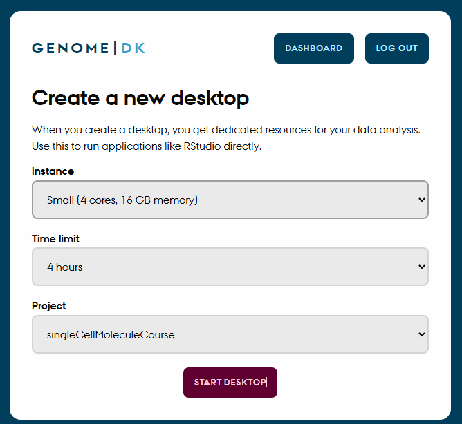
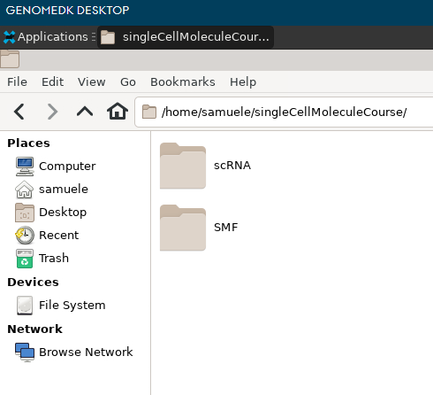

## How to access course folders on the GenomeDK computing cluster to run the course material:

1. Log into genomeDK with your account and password, starting from the [virtual desktop webpage](https://desktop.genome.au.dk). Choose `Start a new Desktop` and then choose one with at least 8 cores. Choose some hours for the session and the project `singleCellMoleculeCourse` (figure below). 

{fig-align="center" width="400px"}

2. Once you are logged in, open the folder `singleCellMoleculeCourse/`, which is found in your home directory. Your home directory is `/home/USERNAME` and is always shown as soon as you open the file explorer on the virtual desktop. 

   Here you will see two folders:

    - `SMF` for the Single Molecule Fluorescence sessions
    - `snRNA` for the single-nucleus RNA-seq sessions

{fig-align="center" width="400px"}

Inside each of these folders, you will find a folder with your name. Go into such folder for the session you are interested in.

3. Now you are ready to continue with the instructions to run the material. From the top menu, choose `SCSM course` and then either `SMF` or `snRNA`.

